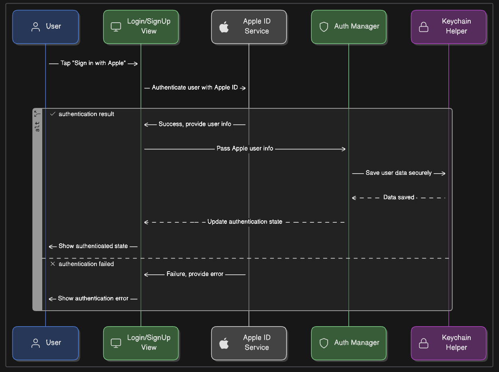

# RealEstate

**Conversion of Airbnb clone to a realEstate app with feature enhancement using cloudkit for data and the challenge to keep the UI same.**

**Explanation Video:** `https://drive.google.com/file/d/1Ccvmp7BY9Tykb4r2xhpkkbErMRHypsV_/view?usp=sharing`

## 🏗️ Architecture Overview

### MVVM Pattern Implementation

The application follows the **Model-View-ViewModel (MVVM)** architecture pattern:

```
┌─────────────┐    ┌─────────────┐    ┌─────────────┐
│    View     │───▶│ ViewModel   │───▶│    Model    │
│  (SwiftUI)  │    │(@Published) │    │ (CloudKit)  │
└─────────────┘    └─────────────┘    └─────────────┘
```

#### **Auth/security**

The application implemenets a secure authentication system using ****Keychain Services**** for credential sotre ****CloudKit**** for user Management

##### **Authentication Architecture**
```
┌─────────────────┐    ┌─────────────────┐    ┌─────────────────┐
│  AuthManager    │───▶│  Keychain       │    │   CloudKit      │
│  ViewModel      │    │  Helper         │───▶│   User Records  │
└─────────────────┘    └─────────────────┘    └─────────────────┘
```

##### **AuthManagerViewModel**
- **State Management**: Uses `@Published` properties for reactive UI updates
- **Guest Mode**: Allows browsing without authentication
- **Persistent Storage**: Secures user credentials in iOS Keychain
- **Automatic Session**: Restores user session on app launch

```swift
class AuthManagerViewModel: ObservableObject {
    @Published var isAuthenticated = false
    @Published var isGuestMode = false
    @Published var currentUser: User?
    
    // Keychain-based persistence
    // Guest mode fallback
    // Automatic session restoration
}
```


##### **Apple ID Authentication Flow**


1. **App Launch**: `loadUserFromKeychain()` checks for existing credentials
2. **No Credentials**: Automatically enters guest mode for browsing
3. **Login Success**: `saveUser()` stores encrypted credentials in Keychain
4. **Session Active**: User remains authenticated across app restarts
5. **Logout**: `removeUser()` securely deletes all stored credentials

#### **Views (SwiftUI)**
- `PropertyListView`: Displays list of available properties
- `PropertyDetailView`: Shows detailed property information
- `BookingView`: Handles reservation creation
- `UserProfileView`: Manages user account information
- `SearchView`: Property search and filtering interface

#### **ViewModels (@ObservableObject)**
- `PropertyViewModel`: Manages property data and CloudKit operations
- `BookingViewModel`: Handles booking logic and reservation management
- `UserViewModel`: User authentication and profile management
- `SearchViewModel`: Search functionality and filtering logic

#### **Models (CloudKit Records)**
- `Property`: Property listings with images, descriptions, pricing
- `Booking`: Reservation records linking users to properties
- `User`: User profiles and authentication data

## 📊 CloudKit Database Architecture


### Property and Booking Management System

The core property and booking system uses multiple CloudKit databases for different functionalities:

#### Database Structure:
- **PaymentDB**: Handles all payment processing and confirmations
- **BookingDB**: Manages property bookings and reservation data
- **iCloud PrivateDB**: Stores user's private data like wishlist items
- **iCloud PublicDB**: Manages public property listings and confirmations

#### Data Flow:
- Users can add properties to their wishlist (stored in iCloud PrivateDB)
- Booking and payment information flows between BookingDB and PaymentDB
- Property listings and confirmations are maintained in the public database
- Property owners receive confirmation notifications through the iCloud PublicDB


### Professional Membership Management

The system includes a professional membership conversion pipeline:

#### Components:
- **PaymentDB**: Processes membership payment transactions
- **ProfessionalDB**: Stores professional user data and status

#### Process Flow:
- User receives information about professional membership
- User makes payment through PaymentDB
- Upon confirmation, ProfessionalDB updates the user's status
- User is converted to a Pro member with enhanced privileges


### Professional Services Platform

Professional users can offer services through a dedicated system:

#### Key Elements:
- **ProfessionalDB**: Manages professional user accounts and service offerings
- **PaymentDB**: Processes service payments from regular users

#### Service Delivery Flow:
- Pros offer services through the ProfessionalDB
- Users pay to avail these services through PaymentDB
- Upon confirmation, the Pro delivers the requested service
- The system maintains the service relationship between users and professionals


### Revenue and Analytics System

The platform includes comprehensive analytics and revenue tracking:

#### System Components:
- **BookingDB**: Source of booking data
- **ProfessionalDB**: Source of professional service data
- **PaymentDB**: Central hub collecting all financial transactions

#### Data Flow:
- BookingDB and ProfessionalDB feed transaction data to PaymentDB
- Regular users receive revenue information from their bookings/services
- Professional users receive detailed analysis of their performance
- The system provides comprehensive revenue insights to both user types

## ☁️ CloudKit Integration

### CloudKit Architecture

```
┌─────────────────┐    ┌─────────────────┐    ┌─────────────────┐
│   SwiftUI App   │───▶│   CloudKit API  │───▶│  iCloud Database│
│   (Frontend)    │    │   (CKContainer) │    │   (Backend)     │
└─────────────────┘    └─────────────────┘    └─────────────────┘
```

### Database Schema

#### **Property Record Type**
```swift
// CloudKit Record: "Property"
- recordID: CKRecord.ID
- title: String
- description: String
- price: Double
- location: String
- images: [CKAsset]
- amenities: [String]
- hostID: CKRecord.Reference
```

#### **Booking Record Type**
```swift
// CloudKit Record: "Booking"
- recordID: CKRecord.ID
- propertyID: CKRecord.Reference
- userID: CKRecord.Reference
- checkIn: Date
- checkOut: Date
- totalPrice: Double
- status: String
```

#### **User Record Type**
```swift
// CloudKit Record: "User"
- recordID: CKRecord.ID
- name: String
- email: String
- profileImage: CKAsset
- userType: String (guest/host)
```

#### **Professional Record Type**
```swift
// CloudKit Record: "Professional"
- recordID: CKRecord.ID
- userID: CKRecord.Reference
- membershipType: String
- serviceOfferings: [String]
- expertise: [String]
- verificationStatus: Bool
```

#### **Payment Record Type**
```swift
// CloudKit Record: "Payment"
- recordID: CKRecord.ID
- userID: CKRecord.Reference
- amount: Double
- paymentType: String (booking/service/membership)
- relatedRecordID: CKRecord.Reference
- status: String
- timestamp: Date
```

### CloudKit Operations in ViewModels

#### **PropertyViewModel**
```swift
class PropertyViewModel: ObservableObject {
    @Published var properties: [Property] = []
    private let container = CKContainer.default()
    
    // Fetch properties from CloudKit
    func fetchProperties() {
        let query = CKQuery(recordType: "Property", predicate: NSPredicate(value: true))
        // CloudKit operation to fetch records
    }
    
    // Save property to CloudKit
    func saveProperty(_ property: Property) {
        let record = CKRecord(recordType: "Property")
        // Convert property to CloudKit record and save
    }
}
```

#### **BookingViewModel**
```swift
class BookingViewModel: ObservableObject {
    @Published var bookings: [Booking] = []
    
    // Create booking with CloudKit reference
    func createBooking(propertyID: CKRecord.ID, userID: CKRecord.ID) {
        let record = CKRecord(recordType: "Booking")
        record["propertyID"] = CKRecord.Reference(recordID: propertyID, action: .deleteSelf)
        // Save booking record
    }
}
```

#### **ProfessionalViewModel**
```swift
class ProfessionalViewModel: ObservableObject {
    @Published var professionals: [Professional] = []
    @Published var professionalServices: [Service] = []
    
    // Convert regular user to professional
    func convertToProfessional(userID: CKRecord.ID) {
        let record = CKRecord(recordType: "Professional")
        record["userID"] = CKRecord.Reference(recordID: userID, action: .none)
        record["membershipType"] = "standard"
        record["verificationStatus"] = false
        // Save professional record
    }
    
    // Add professional service
    func addService(professionalID: CKRecord.ID, service: Service) {
        let record = CKRecord(recordType: "Service")
        record["professionalID"] = CKRecord.Reference(recordID: professionalID, action: .deleteSelf)
        // Save service details
    }
}
```

### Data Flow Architecture

```
User Interaction
       ↓
SwiftUI View
       ↓ (Action)
ViewModel (@Published properties update)
       ↓ (CloudKit API calls)
CloudKit Container
       ↓ (Network request)
iCloud Database
       ↓ (Response)
CloudKit Container
       ↓ (Parsed data)
ViewModel (updates @Published properties)
       ↓ (Automatic UI refresh)
SwiftUI View
```

## 🔄 Real-time Synchronization

### CloudKit Subscriptions
- **Property updates**: Real-time notifications when new properties are added
- **Booking changes**: Instant updates when reservations are modified
- **User profile changes**: Automatic sync across devices
- **Professional service updates**: Notifications when new services are available
- **Payment confirmations**: Instant payment status updates

### Conflict Resolution
- CloudKit handles automatic conflict resolution
- Last-writer-wins strategy for simple fields
- Custom merge logic for complex data structures

## 🚀 Features

### Core Functionality
- **Property Browsing**: Browse available rental properties
- **Search & Filter**: Advanced search with location, price, and amenity filters
- **Booking System**: Complete reservation management
- **User Profiles**: Host and guest profile management
- **Real-time Sync**: Cross-device synchronization via CloudKit
- **Professional Membership**: Upgrade path for professional hosts
- **Service Marketplace**: Platform for professional services

### CloudKit-Powered Features
- **Analytics Dashboard**: Revenue tracking and performance metrics

## 📱 Setup Instructions

1. **Enable CloudKit capability** in Xcode project settings
2. **Configure CloudKit schema** in CloudKit Dashboard
3. **Configure iCloud account** on testing device
4. **Build and run** the application

## 📊 Data Relationships

```
                  ┌───────────┐
                  │  Payment  │
                  └─────┬─────┘
                        │
                        ▼
┌───────┐      ┌────────────────┐      ┌────────────┐
│  User │◄─────┤     Booking    │─────▶│  Property  │
└───┬───┘      └────────────────┘      └──────┬─────┘
    │                                         │
    │                                         │
    └─────────────┐               ┌───────────┘
                  ▼               ▼
            ┌──────────────────────────┐
            │      Professional        │
            └──────────────────────────┘
```

This architecture ensures efficient data management, real-time synchronization, and a responsive user interface following modern iOS development best practices.
